# miHoYo Tool

### 自动模拟键盘打字机

写这个主要是因为有些网站（还有远程桌面）死活不让用 `Ctrl+V`，非得让人手敲，太弱智了。

这玩意儿就是模拟键盘，把你剪贴板里的东西一个字一个字“敲”进去。

### 能干啥？

就是当你遇到**禁止粘贴**的输入框时：

1.  正常复制你的文字。
2.  鼠标点进输入框。
3.  按个快捷键，它就开始自动打字。

### 怎么跑？

下载下来的 `exe` 直接右键 **“以管理员身份运行”** 就行（不给管理员权限没法模拟按键）。

  * **开始**：`F9`
  * **停止**：`F10`

可以在设置里调打字速度，还能加点随机延迟，假装是真人在敲。

-----

随便写的，用的 Python + PySide6 (单纯觉得自带的 tkinter 太丑了)。

本来核心逻辑两三小时就写完了，结果为了调这几个圆角和阴影花了两天。
打包出来的 exe 贼大，忍忍吧，Python 是这样的。
